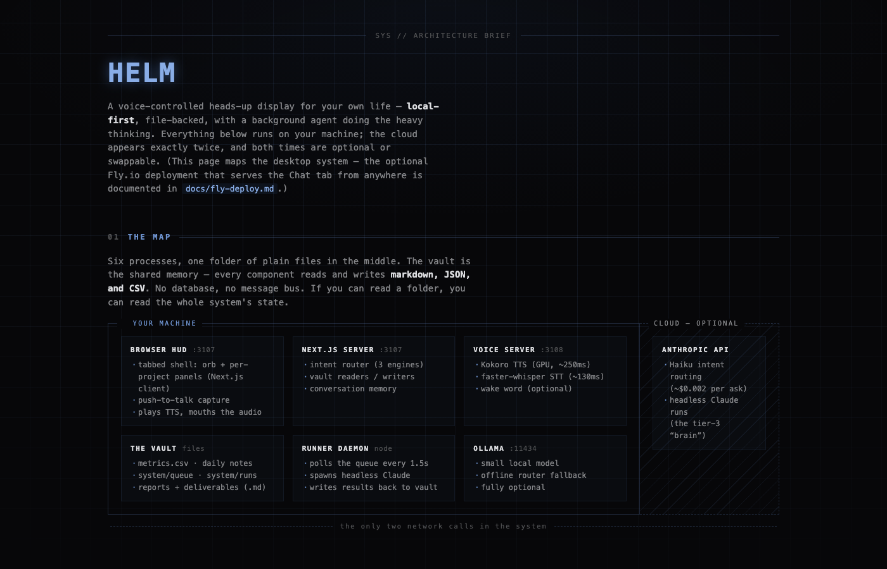

# HELM

[](https://github.com/danielgentile22/helm/actions/workflows/ci.yml)

A voice-controlled heads-up display for my own life — **local-first**,
file-backed, with a background Claude agent doing the heavy thinking. Hold
Space, talk; it answers in under a second, dispatches real work to a queue,
and speaks the results when they land. Every glyph on screen traces to a
real file. No theater.

## Try it in 60 seconds (demo vault)

No credentials, no Claude CLI, no voice stack — just the HUD against the
committed demo vault of fictional data:

```bash
npm install && npm run demo               # → http://localhost:3107
```

Every tab, tile, and feed panel renders populated (daily note, job
applications, USCF rating with a weekly delta, morning-report headlines in
the AI Wire, completed run records, Morphy board, agenda). `npm run demo`
first runs `scripts/demo-freshen.mjs`, which shifts the demo vault's dates
so its "today" is your today — the only thing it touches is data under
`demo-vault/` (that dirties the working tree; `git checkout demo-vault`
restores it); there are no demo flags or code branches in the HUD.

**Non-functional in demo mode** (by design): voice (no voice server),
runner-dispatched skills (the runner status honestly shows OFFLINE — the
graceful degradation is part of the demo), and live feeds (metrics are
canned, not fetched).

## Quickstart

```bash
npm install
export VAULT_ROOT=/path/to/your/vault   # required — no default
npx next dev -p 3107                     # → http://localhost:3107
```

`VAULT_ROOT` points at the folder of plain files the HUD reads and writes
(set it in your shell or `~/.claude/.env`; see [Vault structure](#vault-structure)
for the layout). It's required — start without it and the HUD and runner
both fail fast with a message naming the setting rather than rendering demo
data. Two more pieces make it real:

1. **The runner** (background skill executor): `node runner/runner.js` in a
   second terminal. Needs the `claude` CLI installed and logged in.
2. **Voice** (optional, fully local): see [Voice server setup](#voice-server-setup).

**Day-to-day**: open `claude` in this folder and say **"spin up HELM"** —
it starts whatever isn't running (voice server, runner, HUD) detached, so
everything survives closing the terminal. For automatic start at login,
install the `com.helm.*` launchd agents with `scripts/install-launchd.sh`
(plist templates and the full service inventory live in `scripts/` and
`.helm-config.json`).

## How it works

**Full visual explainer: [danielgentile22.github.io/helm/architecture.html](https://danielgentile22.github.io/helm/architecture.html)**
(also [`docs/architecture.html`](docs/architecture.html) — open in any browser, works offline).
For the *why* behind the interesting parts — the security perimeter, files as
the message bus, router tiers, contract tests — see
[`docs/design-decisions.md`](docs/design-decisions.md).

[](https://danielgentile22.github.io/helm/architecture.html)

The short version:

```
┌──────────────────────────── YOUR MACHINE ────────────────────────────┐   ┌─ CLOUD (opt) ─┐
│                                                                      │   │               │
│  Browser HUD ──── Next.js server ──── THE VAULT ──── Runner daemon ──┼───┼─ Anthropic    │
│  :3107 orb/PTT    :3107 router        plain files    polls queue,    │   │  API          │
│       │           rules→Haiku→qwen    md/json/csv    spawns headless │   │  · Haiku route│
│       │                │                             claude -p       │   │  · claude -p  │
│  Voice server :3108 ───┘              Ollama :11434                  │   │    (tier 3 +  │
│  Kokoro TTS · whisper STT             offline router fallback        │   │     skills)   │
└──────────────────────────────────────────────────────────────────────┘   └───────────────┘
```

- **Voice never leaves your machine** — STT (faster-whisper) and TTS
  (Kokoro) run locally; push-to-talk round trip is 175–500ms on a GPU.
- **Three router tiers**: 1 = dispatch a skill (intent JSON → queue),
  2 = instant answer from the vault snapshot (~25ms), 3 = background
  headless-Claude ask, answer spoken when it lands.
- **Mental model**: the voice layer is a dispatcher, not a worker. Files
  are the message bus — every step of every job is inspectable on disk.

## Vault structure

```
VAULT_ROOT/                       (required — set via env, no default)
├── system/
│   ├── queue/                    intents written by HUD, claimed by runner
│   ├── runs/                     run records + logs (*.json, *.md)
│   ├── metrics/
│   │   └── metrics.csv           timestamp,source,metric,value,status,error
│   ├── schemas/daily-note.md     frozen daily-note contract
│   └── runner-status.json        runner heartbeat (written by runner)
├── daily-notes/YYYY-MM-DD.md     priorities, schedule, focus
├── jobs/applications.jsonl       job applications — one JSON record per line
└── inbox/
    ├── reports/morning/          morning briefings (feeds the AI Wire)
    └── voice/                    voice-ask answers
```

Everything degrades gracefully: missing files render as empty panels, a
dead runner shows RUNNER OFFLINE, missing voice-server returns a clean 503.

**Job applications** (`jobs/applications.jsonl`) back the "Job Applications"
vitals tile. Each line is one application — greppable, hand-editable, and
append-only, so the data is yours independent of the HUD:

```json
{"company":"Acme","role":"Backend Engineer","applied":"2026-06-15","status":"applied","link":"https://..."}
```

`company` or `role` is required; `applied` (YYYY-MM-DD) drives the
"this week" count; `id` (optional) is the de-dup handle. The daily
`feeds/job-applications.py` reads this store and writes `jobs/applications`
(total) and `jobs/applied_7d` (last 7 days) to `metrics.csv`. Append a line
by hand, or seed a sample to demo the tile.

## Configuration

All env vars are read from your shell or `~/.claude/.env` (a plain
`KEY=value` file; process env wins). `NEXT_PUBLIC_*` vars go in `.env.local`
in the repo root instead (they're inlined into the client at build).

| Var | Purpose | Default |
|---|---|---|
| `VAULT_ROOT` | vault folder | **required** (no default) |
| `CLAUDE_PROJECTS_DIR` | transcript root the token feed scans | `~/.claude/projects` |
| `JOBS_DIR` | folder holding `applications.jsonl` (job feed) | `$VAULT_ROOT/jobs` |
| `AGENDA_SYNC_MIN` | calendar-agenda refresh cadence (minutes) | `30` |
| `PYTHON_BIN` | interpreter the runner spawns the calendar feed with | `/usr/local/bin/python3` |
| `GCAL_CLIENT_SECRET` | Desktop OAuth client JSON (calendar feed) | `~/.claude/helm-gcal-client.json` |
| `GCAL_TOKEN` | stored Google refresh token (calendar feed) | `~/.claude/helm-gcal-token.json` |
| `HUD_TZ` | IANA timezone for "today" (HUD + runner) | `America/New_York` |
| `HUD_USER_NAME` | how voice notes refer to you | `User` |
| `AGENTIC_OS_MODEL` | model for background `claude -p` runs | `claude-opus-4-8` |
| `ANTHROPIC_API_KEY` | enables Haiku intent routing (~$0.002/ask) | unset (optional) |
| `VOICE_ROUTER` | force router engine: `auto`/`rules`/`haiku`/`local` | `auto` |
| `VOICE_ROUTER_MODEL` / `OLLAMA_URL` | local routing fallback | `qwen3:4b` / `:11434` |
| `VOICE_SERVER_URL` | TTS/STT server | `http://127.0.0.1:3108` |
| `KOKORO_VOICE` / `KOKORO_SPEED` | TTS voice + speed | `bm_george` / `1.0` |
| `WHISPER_MODEL` / `WHISPER_PROMPT` | STT model + vocab bias | `small.en` / built-in |
| `KOKORO_DEVICE` / `WHISPER_DEVICE` | force `cpu` if CUDA misbehaves | auto |
| `WAKE_WORD` / `WAKE_MODEL` | opt-in hands-free wake (`on`/`off`) + openWakeWord model name | `off` / unset (push-to-talk) |
| `NEXT_PUBLIC_OBSIDIAN_VAULT` | Obsidian vault name for deep links | unset (link hidden) |
| `NEXT_PUBLIC_VOICE_WS` | wake-event websocket | `ws://127.0.0.1:3108/events` |

⚠️ `ANTHROPIC_API_KEY` belongs in the `~/.claude/.env` FILE only — set as a
system-wide env var it flips your interactive `claude` CLI from
subscription to API billing.

## Calendar agenda feed

The HUD's agenda tile is fed by `feeds/calendar-agenda.py`, a deterministic
Google Calendar API call the runner spawns on boot and every `AGENDA_SYNC_MIN`
minutes (it writes `system/agenda.json`; the HUD only ever reads that cache).
It replaced the headless `claude -p` agenda agent — no LLM, no MCP. One-time
setup:

1. Install the Google client libraries into the interpreter the runner uses
   (the same `PYTHON_BIN` the other feeds run under):

   ```
   /usr/local/bin/python3 -m pip install google-auth google-auth-oauthlib google-api-python-client
   ```

2. In [Google Cloud Console](https://console.cloud.google.com/): create a
   project, **enable the Google Calendar API**, then create an **OAuth client
   ID of type "Desktop app"** and download its JSON. Save it to
   `~/.claude/helm-gcal-client.json` (outside the vault — credentials never
   live in the vault, the repo, or transcripts).

3. Run the one-time consent (opens a browser, asks for read-only calendar
   access, stores a refresh token at `~/.claude/helm-gcal-token.json`):

   ```
   python3 feeds/calendar-agenda.py --auth
   ```

Every sync after that is headless. A `python3 feeds/calendar-agenda.py` with no
flag runs one sync by hand. If a sync writes `ok:false` with an `auth:` reason
(refresh token revoked/expired), re-run the `--auth` bootstrap — the reason
string names that command.

## Voice server setup

Fully local TTS + STT. One-time setup:

```bash
cd voice-server
python -m venv .venv
.venv/bin/pip install kokoro-onnx fastapi uvicorn websockets soundfile faster-whisper onnxruntime
# NVIDIA GPU: swap plain onnxruntime for onnxruntime-gpu + the matching
# nvidia-cudnn-cu12 / nvidia-cublas-cu12 / nvidia-cufft-cu12 wheels.
```

Download `kokoro-v1.0.onnx` (~325MB) and `voices-v1.0.bin` (~28MB) from the
[kokoro-onnx releases](https://github.com/thewh1teagle/kokoro-onnx/releases)
into `voice-server/`. Start: `.venv/bin/python server.py`. GPU gives
~250ms/sentence TTS and ~130ms STT; CPU works at ~4x slower.

**Pick your voice**: `python make_samples.py` regenerates `samples/` +
open `audition.html`, pick, set `KOKORO_VOICE`/`KOKORO_SPEED`, restart.

**Input is push-to-talk** (hold Space). Hands-free wake is off by default
and intentionally unbundled — without headphones the wake mic hears the
HUD's own speech. To opt in, `pip install --no-deps openwakeword` (the
`--no-deps` is LOAD-BEARING — a bare install overwrites onnxruntime-gpu
with the CPU build), point `WAKE_MODEL` at an openWakeWord model name, and
set `WAKE_WORD=on`.

## Using it

- **Tabs** — the shell is organized by project: Today / Morphy / Job
  Search / Chess / Chat. Each tab carries its own panels and deck
  buttons; on a phone the tabs become a bottom tab bar.
- **Hold Space** — push-to-talk (desktop). "Brief me" / "good morning" =
  the spoken rundown. "What's in the queue", "what's my chess rating" =
  instant answers. "Run the inbox brief" = dispatch. Anything open-ended =
  background ask, spoken when ready.
- **Esc** closes an open overlay, else stops speech; clicking a Documents
  row opens the report overlay.
- **Chat tab** — typed conversation with the same router/brain; the voice
  transcript is a Documents row (open it to read, "reset transcript ×" to
  clear). For chat from your phone anywhere, see `docs/fly-deploy.md`.

## Security

The HUD binds **127.0.0.1 only**, and every state-changing route requires
the `HELM_API_KEY` shared secret (from `~/.claude/.env`) sent as
`X-HELM-KEY` — no key configured means writes fail closed (503). It still
assumes a trusted machine: never bind it to `0.0.0.0`, never port-forward
3107/3108 — `/api/queue` feeds the runner's headless Claude.

## Platform notes

Everything is Node/Python and runs cross-platform. On Apple Silicon use
plain `onnxruntime` (CPU) or set `KOKORO_DEVICE=cpu`/`WHISPER_DEVICE=cpu`.
The `.vbs` files are Windows launcher conveniences; on Mac/Linux use `node
runner/runner.js &` and `python voice-server/server.py &` (or launchd /
systemd).

## Quality gates

After any `lib/` change: `npm test` + `npx tsc --noEmit`. The test chain
runs the runner syntax check, the TS suites (router sweep, skill/tab
contract, security, feeds glue, chat), then the Python voice-server and
feed suites — it needs `python3` on PATH and spends no API tokens. After
any `runner/runner.js` edit, `node --check runner/runner.js` — the runner
fails silently on syntax errors.
