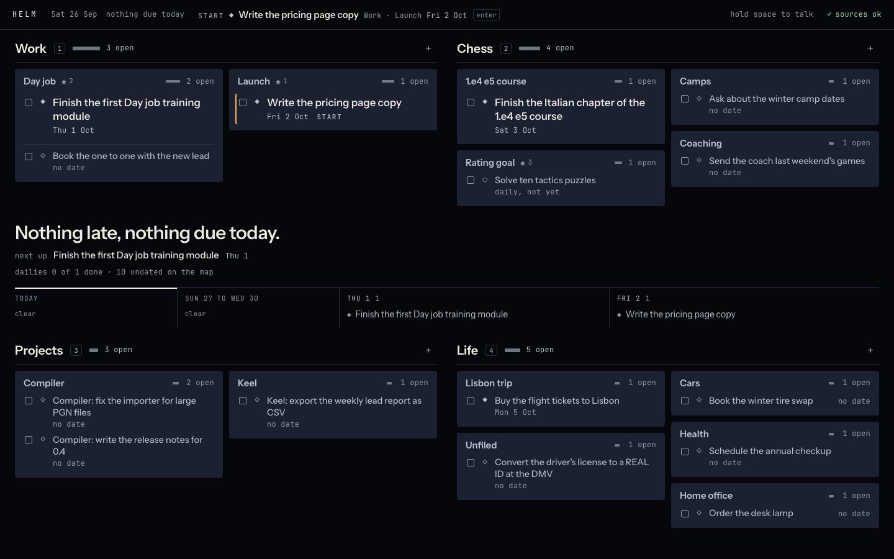

# HELM

[](https://github.com/danielgentile22/helm/actions/workflows/ci.yml)

A personal operating system that runs on one always-on Mac. It reads a private
Obsidian vault, keeps the owner's todos and routines in view, and lets them reach
Claude Code from a phone or by voice. This repo is the engine. It knows nothing about
the person it serves until it reads their vault, so everything personal stays out of
it.



*The dashboard against `demo-vault/`, a vault of fictional data.*

## What runs

- **Helm Chat** (`chat/`). A phone web app that drives Claude Code sessions on the
  Mac over the owner's tailnet, behind a passkey. Threads are an append-only event
  log, so a dropped connection resumes where it left off, and finished chats are
  mirrored into the vault as notes. Node, Hono and Svelte 5.
- **The dashboard** (`dashboard/`). One screen of everything that is late, due or
  starred across four departments (Work, Projects, Chess, Life), drawn as a pressure
  map: position and ink come from due dates and directive stars. Todos can be ticked,
  edited and added from it, and each write is a commit in the vault. A Python
  standard library server and a Svelte 5 build.
- **Talk** (`voice/`, `skills/voice-todo/`). Hold Space and say "push the dentist to
  Monday". A local speech server (faster-whisper and Kokoro, CPU only) transcribes
  it, a headless Claude run turns the sentence into todo edits, and the answer is
  spoken back.
- **Routines** (`runner/`). launchd jobs generated from `models.json`: capture
  (deterministic producers that read todos, schedules and git state every 30
  minutes), a daily integrity check that proves every router pointer in the vault
  still resolves, and a backup that snapshots the vault to a local drive when it is
  mounted.

## Three homes

| Home | Holds | Rule |
|---|---|---|
| this repo | code, docs, a demo vault | public, and history is forever |
| the vault | notes, todos, decisions | private git repo with no remote |
| `~/.helm` | chat threads, credentials, status, logs | private, mostly disposable |

A commit-time guard enforces the first rule. `pre-commit`, `commit-msg` and
`pre-push` hooks check every added line, path and commit message against a deny list
kept outside the repo, a path allowlist, and secret, email and phone patterns. A
missing deny list fails closed. Its tests run in CI.

## Try it against the demo vault

```bash
git clone https://github.com/danielgentile22/helm && cd helm
export HELM_VAULT_ROOT=$PWD/demo-vault HELM_STATE=$(mktemp -d)
python3 runner/producers/capture.py
(cd dashboard && npm ci) && python3 dashboard/serve.py
```

The dashboard opens on `127.0.0.1:8642`. Talk needs the voice server
(`voice/README.md`) and Claude Code; Helm Chat needs a tailnet and a passkey
(`chat/docs/SETUP.md`).

## Security model

The Mac runs Claude Code with broad permissions, so every surface is built to be
reachable by exactly one person. Servers bind to loopback only. The phone reaches Helm
Chat through `tailscale serve` and a WebAuthn passkey, and the dashboard splits its
routes into loopback-only, tailnet and open by endpoint. The records are in
`docs/adr/`, starting with 0003 (bind to loopback), 0016 (reach split by endpoint) and
0025 (the tailnet door is a passkey).

## Decisions

`docs/adr/` holds 34 architecture decision records. 0001 to 0009 are from HELM 1, the
earlier version whose heads-up display is kept in `archive/hud/` and runs from the
`helm1-final` tag. 0010 onward cover the engine as it runs today.

## Tests

CI runs the guard tests, Helm Chat's suite and typecheck, the engine's Python suites
and the dashboard's checks on every push to `main`. `CLAUDE.md` lists the commands.

## License

MIT
